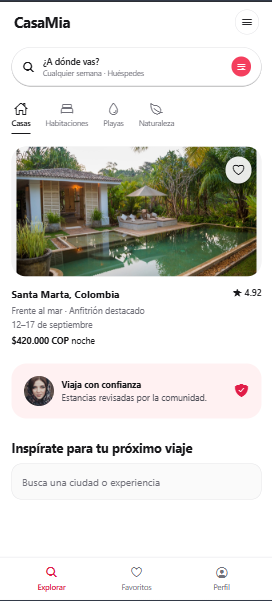

# CasaMia

Aplicación móvil de alojamientos inspirada en la pantalla de inicio de Airbnb.
Fue desarrollada con Expo, React Native y TypeScript como entregable de la
Semana 2: Layouts, Componentes Core y NativeWind.

## Stack

- React Native con Expo SDK 54
- Expo Router
- TypeScript
- NativeWind y Tailwind CSS
- Expo Image

## Cómo ejecutar el proyecto

```bash
npm install
npx expo start
```

Presiona `w` para abrir la aplicación en el navegador, o escanea el código QR
con Expo Go desde el celular.

## Funcionalidad implementada

- Encabezado con la marca CasaMia y acceso al menú.
- Buscador para escribir una ciudad o experiencia.
- Categorías de alojamiento: Casas, Habitaciones, Playas y Naturaleza.
- Tarjeta de alojamiento en Santa Marta con imagen, fechas, precio y
  calificación.
- Sección de confianza con avatar y mensaje para el usuario.
- Barra de navegación inferior con Explorar, Favoritos y Perfil.
- Estados visuales al presionar los botones.

## Componentes utilizados

| Requisito | Dónde se cumple |
|---|---|
| `SafeAreaView` y `ScrollView` | Contenedor principal de `app/index.tsx` |
| `TextInput` | Campo de búsqueda de ciudad o experiencia |
| `Image` | Imagen del alojamiento y avatar del usuario |
| `Pressable` | Menú, buscador, categorías, favorito y navegación inferior |
| `useState` | Estado del texto escrito en el buscador |

Los estilos de la interfaz se realizaron con clases de utilidad de NativeWind,
sin utilizar `StyleSheet.create()`.

## Configuración de NativeWind

La configuración se encuentra en los siguientes archivos:

- `babel.config.js`
- `metro.config.js`
- `tailwind.config.js`
- `global.css`

`global.css` contiene las directivas de Tailwind y se importa desde el layout
principal de Expo Router.

## Validación

Para revisar el proyecto se puede ejecutar:

```bash
npm run lint
```

## Uso de IA

Durante el desarrollo utilicé GitHub Copilot como guía para resolver dudas,
revisar decisiones de estructura y consultar alternativas para los componentes
de React Native. El código se revisó y se ajustó dentro del proyecto para
adaptarlo al diseño y a los requisitos de la actividad.

## Captura de pantalla

La siguiente captura corresponde a la pantalla principal de CasaMia ejecutándose
en un viewport móvil:


